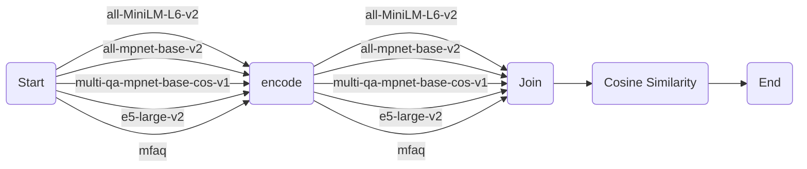

# Evaluating Text Embedding Models (with Metaflow)

This Metaflow implementation evaluates various HuggingFace embedding models using a given corpus and queries.

Refer to [corpus.txt](./data/corpus.txt) and [queries.txt](data/queries.txt) to view sample data

## Models for Evaluation

The following models will be evaluated:

- [sentence-transformers/all-MiniLM-L6-v2](https://hf.co/sentence-transformers/all-MiniLM-L6-v2)
- [sentence-transformers/all-mpnet-base-v2](https://hf.co/sentence-transformers/all-mpnet-base-v2)
- [sentence-transformers/multi-qa-mpnet-base-cos-v1](https://hf.co/sentence-transformers/multi-qa-mpnet-base-cos-v1)
- [intfloat/e5-large-v2](https://hf.co/intfloat/e5-large-v2)
- [clips/mfaq](https://hf.co/clips/mfaq)

## Variations in Evaluating `intfloat/e5-large-v2` and `clips/mfaq Models`

### intfloat/e5-large-v2

For the `intfloat/e5-large-v2` model, the input text should start with either "query: " or "passage: ". For tasks other than retrieval, the "query: " prefix can be used. The data is formatted accordingly before encoding.

### clips/mfaq

For the `clips/mfaq` model, the questions need to be prepended with "<Q>", and the answers with "<A>". The data is formatted accordingly before encoding.

For all other models, the data is formatted as-is before encoding.

## Program Flow

The program flow can be described as follows:

1. **Start**: The flow begins by reading the corpus and queries from text files. It then moves to the `encode` step for each model in the `txt_embed_models` list.

2. **Encode**: In this step, the flow encodes the corpus and queries using the specified model. It checks if the model is 'intfloat/e5-large-v2' or 'clips/mfaq' and applies the appropriate encoding method. Otherwise, it uses the default encoding method. After encoding, the flow moves to the `join` step.

3. **Join**: In this step, the flow gathers the corpus embeddings and query embeddings from all the `encode` steps. It then moves to the `calculate_similarity` step.

4. **Calculate Similarity**: In this step, the flow calculates cosine similarity scores between the query embeddings and corpus embeddings for each model. It then moves to the `end` step.

5. **End**: This is the final step of the flow. It prints the top 3 hits for each query for each model.

Here is a mermaid diagram that depicts the program flow:



>Please note that you need to have a Mermaid extension installed in your Markdown viewer to view the diagram. If you're viewing this on GitHub, you can use a browser extension like Mermaid Markdown Viewer for Google Chrome.

## Installation

To run this script, you will need to install the following Python packages:

- metaflow
- transformers
- torch
- sklearn
- numpy

You can install these packages using pip:

```bash
pip install metaflow transformers torch sklearn numpy
```

## Streamlit App

For an interactive application using `intfloat/e5-base-v2`  for encoding and displaying top k hits on sagemaker faqs is available at [streamlit_sagemaker_faqs_e5.py](streamlit_sagemaker_faqs_e5.py).

To run this app:

```shell
streamlit run streamlit_sagemaker_faqs_e5.py
```

## Summary

This script provides a way to evaluate various Hugging Face text embedding models on a given corpus and set of queries. It handles variations in the encoding methods required by different models and calculates cosine similarity scores between the query and corpus embeddings. The results are printed as a table for each model, showing the top 3 hits for each query. The script is implemented using Metaflow, a human-friendly Python library that helps scientists and engineers build and manage real-life data science projects.

To run the script, execute the following command:

```shell
python3 evaluate_text_embedding_models.py --no-pylint run; \
python3 evaluate_text_embedding_models.py card view end
```

The results will be displayed in the console output.

Note: Update the `corpus_file` and `queries_file` parameters in the script to point to the actual file paths of the corpus and queries.

For more information on Metaflow, refer to the [Metaflow documentation](https://metaflow.org/).
